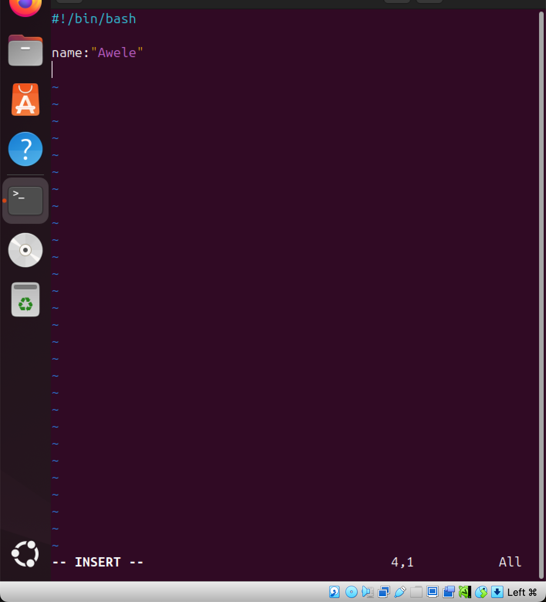
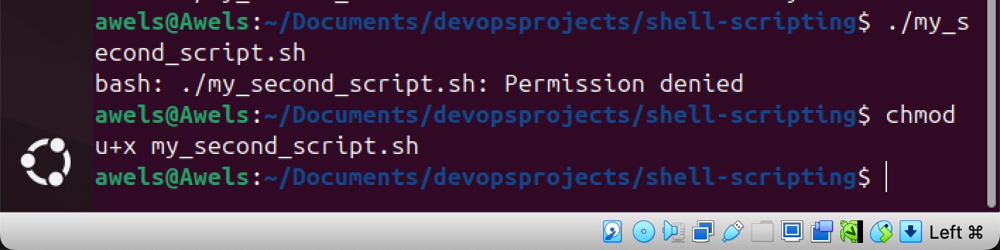

# LinuxShellScripting
a shell scripting project on Linux done by me. 

this projet centers on shell scripting and understanding shell scripting fully. during the course of this project, i have gained deep understanding of the concept of shell scripting as well as how to execute a bash script. i was able to run these tasks in the project successfully. i also learnt the use of variables and how to attach values to each variables. i went ahead to widen my knowledge on this by applying more examples and testing out extra examples outside the scope of the project so taht i can gain mastery in shell scripting and i succeded in doing so. 

# The First Task
## Create a folder on my ubuntu server and name it shell-scripting
This is done by using the command "mkdir" and the name of the folder we intend to create. 
Hence, since we are creating afolder with the name "shell-scripting" the command we would be running is 'mkdir shell-scripting'

The image below shows the command in my ubuntu terminal 

immediatly i click enter, the folder called 'shell-scripting' would be created. 

here, the folder is created and since I would be working in the folder, I would have to enter into the folder using the 'cd' command. 

This is done by using the command 'cd shell-scripting'. The image below depicts this. 

now that I ma in the folder, I can move to the next task. 

# The Second Task
## using the Vim Editor to create a file and name it 'my_first_shell_script.sh' 

this is done by runnimg the command 'vim my_first_shell_script.sh'

 
once I click enter on this command, vim would automatially create a folder named my_first_shell_script.sh

the image below shows the above statement. vim has automatially created the folder and I can start writing in it. 

this leads me to the third task 

# The Third Task
## I am to put some shell scripting code on the file. 

the image below shows the shell scripting code i inserted on the file. 

# The Forth Task
## save the vim file 

the image below shows that the file has been saved and i can proceed to the next task

# The Fifth Task 
## use cd command to change into the shell_scripting directory. 

I am currently in the shell_scripting command. the picture below depicts this. 

# The Sixth Task
## use 'ls -latr' command to comfirm the file is indeed created

this is done by using the command 'ls -latr' on the terminal and in the shell_scripting directory. the image below depicts this.

from the above image, the permission attached to the file shows that nobody has the permission to execute. the permission on the file is -rw--r--r-- but there is no permission to execute. 

which means that when i try to run this script it would be denied because there is no permission to execute. from the above image, it means the users has the right to reasd and write, the members of the file group can read and others can read as well but nobody can execute the file. 

the picture below depicts this as i tried to run it but it was denied. 

the command for running the bash script is './my_first_shell_script.sh'

it is worthy to note that the '.' represents the cureent directory and the '/' represents a directory separator. 

from the image above, it depicts that the permission to run the script was denied and this is because no one has thee access to execute the script yet. 

# the Seventh Task
## Add the execute permission for the owner to be able to execute the script. 

This is done by using the command 'chmod u+x my_first_shell'

the image below shows the command on my terminal
 

the image below shows that the command has been succesful and i can proceed to execute the shell script. 

to run the bash script this is done by using this command './my_first_shell'

the image below shows that the script has been successfully executed. but before now, i was asked to impute my password 

after imputing my password, there was a little issue with the adding of the third user and this was due a typographical on my part. i was able to get into the vim file and correct the mistake and re-executed the shell script and everything was successful. the image below depicts this. 

# The Eight Task. 
## Confirm that the Users are created and the folders are created. 

Lets start with confirming if the folders are created and this is done by running the command 'ls -l' on the terminal. 

from the image above this shows that the folders i imputed on the shell script to be created once i execute the shell script was successfully created.

The next thing is to confirn if the users are created also. this is done by using the command 'id user1' 'id user2' 'id user' 

now lets run this command on my terminal starting from the user1

from the image below after running the 'id user1' it shows that the user1 was created successfully after executing the bash script 

the next one is to comfirm if the second user was successfully created. 
this is done by using the command 'id user2'

from the image below, this shows that the user2 was successfully created immediatly the shell script was executed.

the next one is to comfirm if the user3 was also created after executing the shell script. 
this is done by using 'id user3'

the image below shows that the user3 was successfully created after runnning the command on my terminal to confirm. 

# The Ninth Task
## explore the values and variables. 

understanding values and variables are important in bash scripts. in this task i would be assigning values to variables but the first task is to create a new file where i would be running the variables and values on. 

the first thing to do is to create a new file and this is done by running this command on my terminal 'vim my_second_script.sh'

the image below depicts the file being created and the vim has already opened the file.

now i would be creating my variables and attaching values to them. 

but the first thing to do is to first impute this '#!/bin/bash

the next thing is to start creating the varaibles and attaching values to them. 

from the task i was asked to create a variable called name and attach value to it and this can be done in this way

name:"Awele"

the image below depicts this 

i would be adding extra to this so that i can understand the variables and values properly.  
i would be running the variable called "current_date" and attaching a value to it. 

the image below depicts this 

i would also be attaching comments to help the script to be easily understood. the image below depicts this 

i would also be running another example and creating a variable called "current_time" and i would be assigning value to it. 

the image below depicts this. 

i also attached echo so that i would be able to access if the scipt has been successfully created. 
the image below depicts this 

the next thing to do is to save the file and the image below depicts this 

the next to do is to execute the script and this is done using the command './my_second_script.sh'

the image below depicts this 

after running this command, the permission was denied and this is as a result of no one which means the user, group and others, not having the permission to execute the file. this can be corrected by running this command 'chmod u+x my_second_script.sh'

the image below depicts this 

now that i have given the user the permission to execute, i will execute the script again 
this is done by using the command './my_second_script.sh'

i encountered some challenges and this was as a result of some mistakes on my script. i was able to go over it and correct my mistakes from this 

to this 

now that this is done, the next thing to do is delete the users and folders earlier created and the files earlier created. 

lets start with deleting the folders and this is done by running this command 'rmdir folder1 folder2 folder3'

the image below depicts this 

the next thing to do is to delete the users earlier created and this is done by running this command 
'userdel user1'
'userdel user2'
'userdel user3'

the image below depicts this 

the users have been successfully deleted. 

the next thing to do is to delete the vim files 
starting qwith the first one which is done by running this command 'rm -r my_first_shell' 'rm -r my_secong_script.sh'

the image below depicts this command and shows that the file has been successfully deleted 

to confirm that everything has been successfully deleted i would use this command 'ls -l'

the next thing is to delete the main folder that i worked on this is done by running the command 'rm -rf' and the folders name.

the image below depicts that. 

# CONCLUSION

i have concluded the task and i fully understand the concept of shell scripting, the concept of variables and values. how to use the shell script etc. 